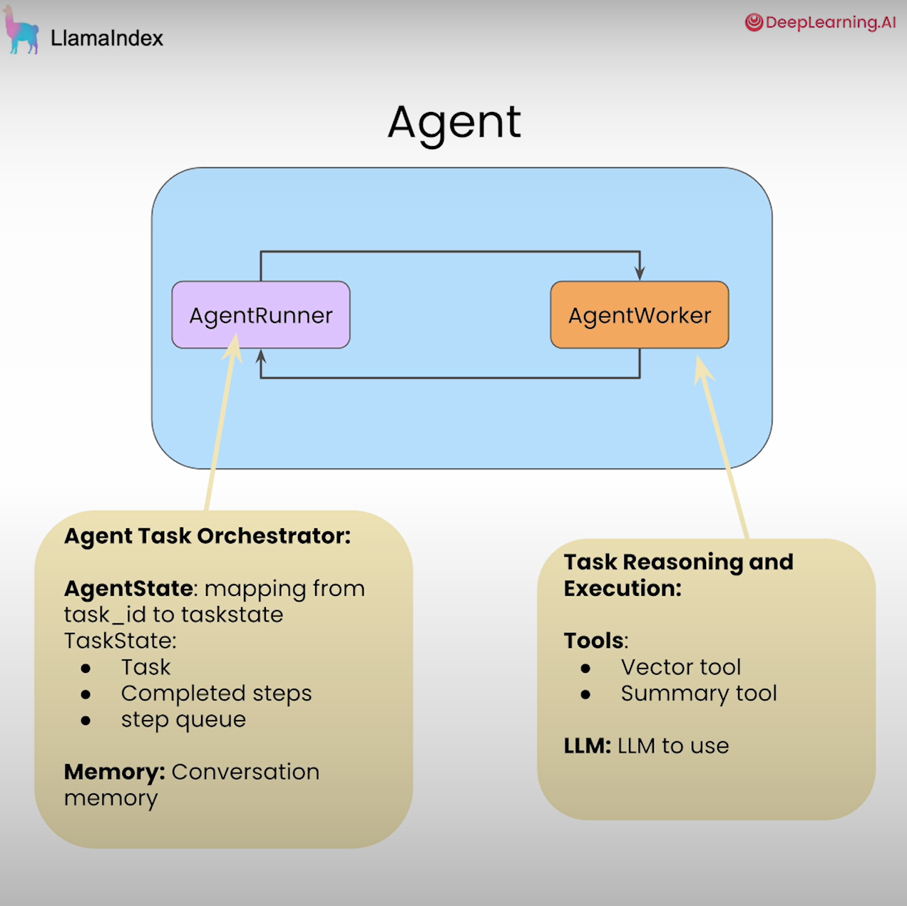
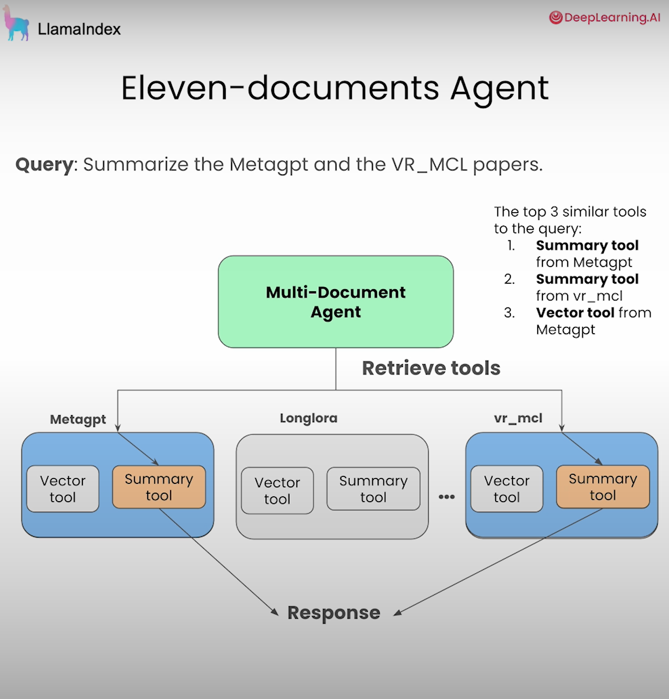

# Agentic-RAG-with-Llamaindex

This is my code and studynote for the course [Building Agentic RAG with LlamaIndex](https://www.deeplearning.ai/short-courses/building-agentic-rag-with-llamaindex/) 📚 A super informative and practical course. Highly recommended! 😎 

# ✅ Lesson 1. Tools Calling using a Router Engine

* In standard RAG, LLM are mainlysed used forr synthesis of information only.
* A router engine adds additional functionality which enables LLM to determine whether to implement a Q&A (vector search) or a summarization query engine/tool based on the question from the user
* See `L1_Router_Engine` notebook & `get_router_query_engine()` function in `utils`

# ✅ Lesson 2. Tool Calling & Infer Parameters

* In this interation, the LLM not only helps choosing the appropriate tool but also infer necessary arguments for execution. 
* The end result is that users get to ask more questions and receive more preciese results. 
* See `L2_Tool_Calling`notebook & `get_doc_tools()` function in `utils`

# ✅ Lesson 3. Multi-steps Agent

* Use AgentRunner to plan and orchestrate multi-step tasks 
* Use AgentWorker to execute the tasks. 
* Human users can 
    * inspect and chat with the agent about its reasoning and responses 💭
    * control the agent in a granular fashion, which also enhances debuggability and steerability of the agent. 🧭

# ✅ Lesson 4. Handling multiple documents: RAG over the Tools

* When handling query over multiple documents：
    * we can create vector search and summary tools respectively for each document and feed them to the agent. 
    * But when the amount of documents increases, this solution leads to higher cost and latency as there are now more tokens in our prompt. Further more, the outline can actually get confused and the LLM may fail to pick the right tools when there are too many choices. 🤨

* Therefore, let's create RAG over these tools instead. 😎 
    * Create a retriever which can retrieve a small subset of tools based on their relevance to the query
    * Then instead of passing all the tools to the agent, we pass the retriever to it 🐕‍🦺
    * The retriever can leverage different retrieval techniques tailored to each use case. For example, it could be as simple as just picking the top 3 most similar tools to the query.

